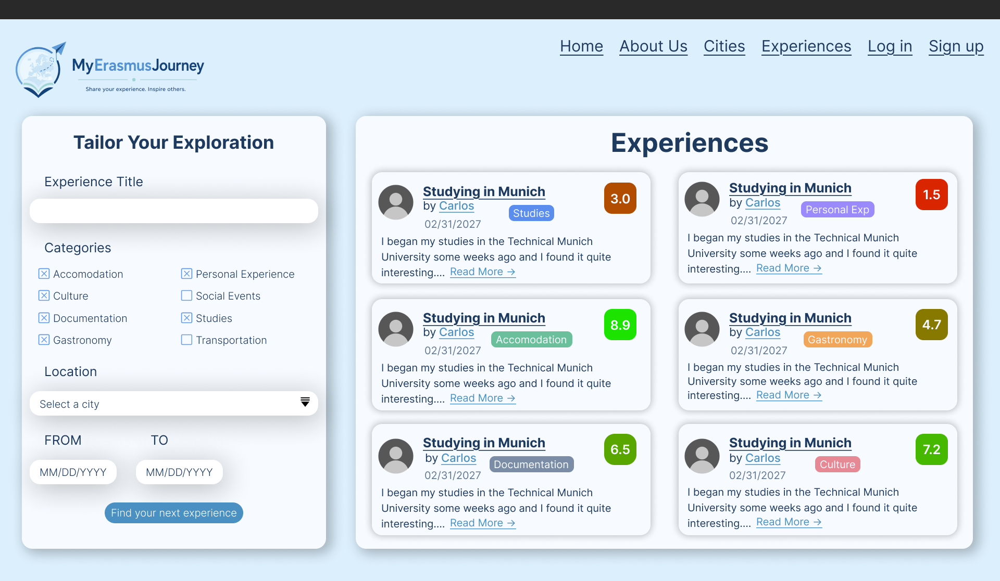

# MyErasmusJourney: A web application for sharing Erasmus experiences

## What is *MyErasmusJourney*?

*MyErasmusJourney* is a web application where students can share their Erasmus experiences, describing problems they faced, useful documentation, and memorable social events during their stay abroad.

It also serves as a discovery platform for future Erasmus students, allowing them to explore destinations, read real experiences, and make informed decisions about their future mobility program.

⚠️ This project is currently in the **Repository Setup, Testing and CI Phase**. Minimal functionalities have been implemented.

---

## 🎯 Project Objectives

The main objective of *MyErasmusJourney* is to create a community-driven platform that connects current and future Erasmus students through shared experiences.

The application aims to:
- Facilitate the exchange of real Erasmus experiences
- Help future students choose their destination
- Provide useful information about cities and countries
- Encourage interaction between users through posts and comments

---

## ⚙️ Technologies (planned)

- Frontend: React
- Backend: Spring Boot
- Database: MySQL
- Authentication: JWT-based system

#### Complementary Technology

- Interactive Maps and Geographical Visualization: A mapping solution will be integrated to display Erasmus destinations on a European map and experiences on city-level maps. The specific technology has not yet been selected and will be evaluated during the implementation phase.

#### Additional Integrations

- External APIs and third-party services: not yet decided.

---

## 📚 Documentation

1. [Objectives](./docs/objectives.md)
2. [Methodology](./docs/methodology.md)
3. [Functionalities](./docs/functionalities.md)
4. [Advanced Algorithms](./docs/advanced-algorithms.md)
5. [Entities](./docs/entities.md)
6. [User permits](./docs/user-permits.md)
7. [Web interface](./docs/website-prototype.md)
8. [Analysis](./docs/analysis.md)
9. [Changelog](./docs/changelog.md)
10. [AI Usage](./docs/ai_usage.md)
11. [Development Guide](./docs/development_guide.md)

---

## ⚠️ Status

This repository currently contains only the **analysis and design phase** of the project.  
Implementation will begin in later phases following an iterative and incremental development approach.

The current progress and task tracking of the project can be consulted in the following GitHub Projects board:

👉 [MyErasmusJourney Project Board](<https://github.com/orgs/codeurjc-students/projects/42>)

This board is used to manage tasks, track development progress, and monitor the current state of each feature (e.g., To Do, In Progress, Done).

---

## 👨‍💻 Author

This project is being developed as part of a Final Degree Project (TFG) in the Degree in Computer Engineering at ETSII - URJC.

- **Student:** Jaime Ochoa de Alda Cerdán
- **Supervisor:** Michel Maes Bermejo