This document will give you an idea of the different pages that form the website version of the app and what can be done in the each of them.

### Home
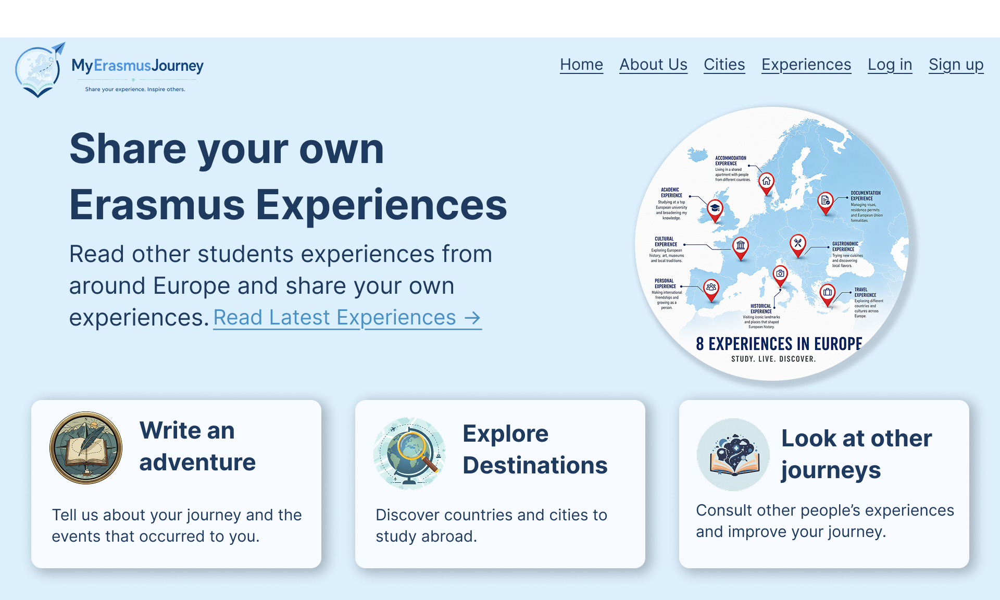

As you would expect this is the welcome page, it shows the different objectives the application and gives a little introduction into it. The top menu is displayed in all pages as shortcuts to different pages.

### About Us
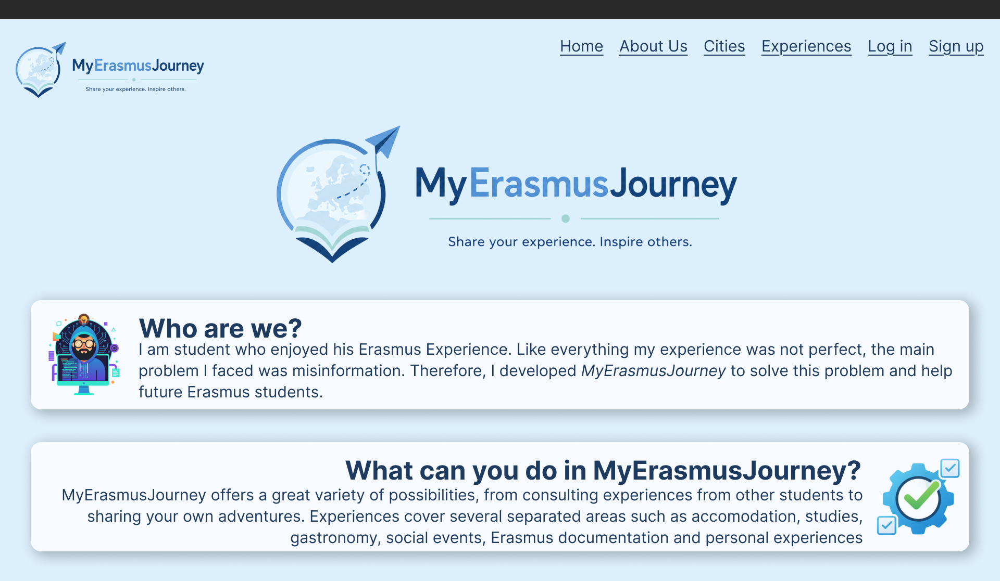

This page explains the reason why the application was developed and what can users do inside the application.

### Error
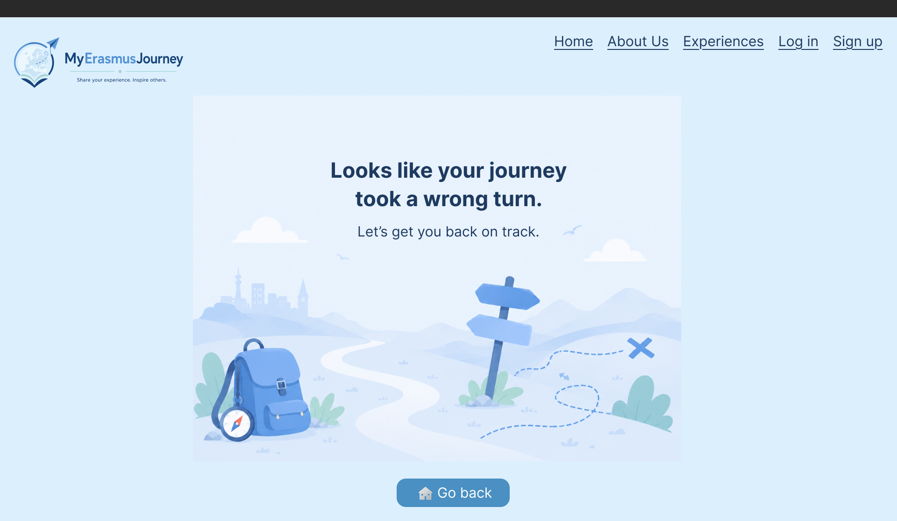

The page that will be displayed every time something goes wrong, either an internal error of the application, a page that doesn't exist or an user trying to access information without the right credentials.

### Log in
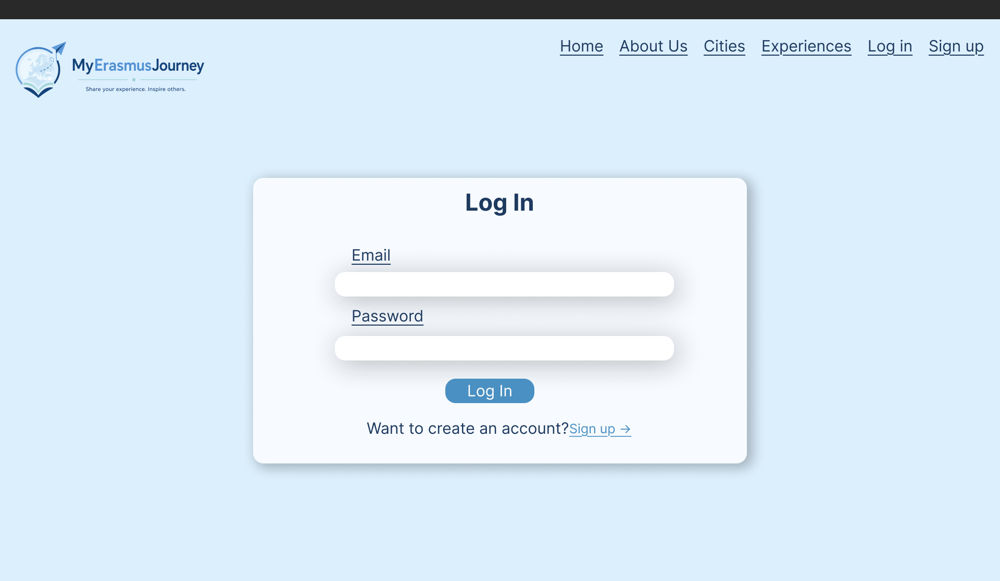

The log in form that allows users to identify and authenticate themselves. 

### Sign up
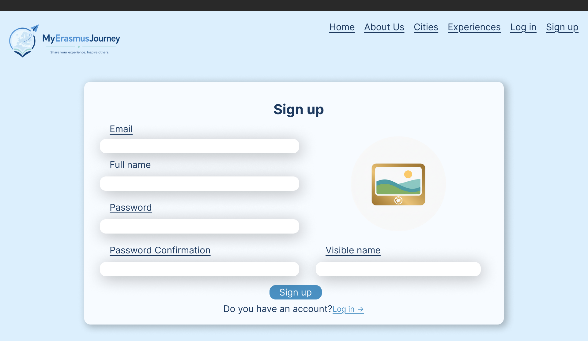

Every new user who wants to share their experience or comment on other students posts, will have to go through this form in the sign up page.

### Experiences

The experiences page allows users to see all the experiences that have been posted by students and filter them. The filter is very precise, allowing users to filter by dates, category or city. It also allows to search by titles. The results of the filter will be displayed on the right side of the page.

### Detailed Experience

The detailed experience page will expand a specific post, giving access to the full description, multimedia attached and comments. Users will be able to enjoy the multimedia attached to the post, share the experience and express their thoughts on the comments.

### Experience form
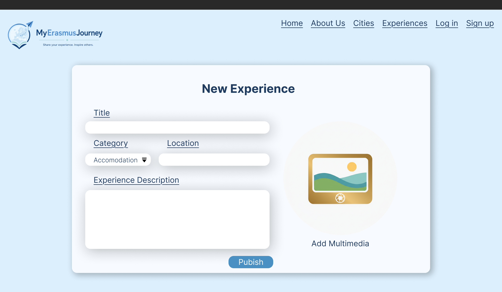

This is the form every user will have to fill in order to post a new experience, selecting a category, giving their story a title, as well as the story itself and a location of where it happened.

### Cities
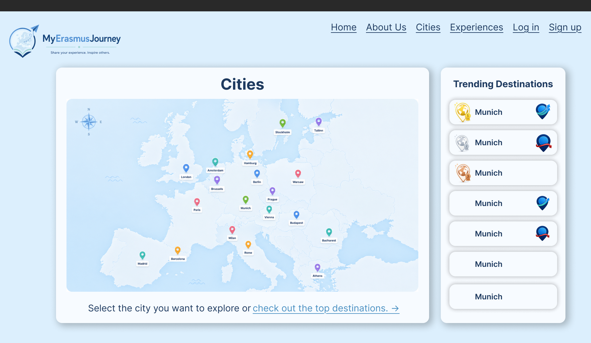

This page may seem like a simple map image, but the idea behind it it's quite interesting. The map will have all the available cities pinpointed, and the user will click on the city's location on the map to explore that city's page.

### City
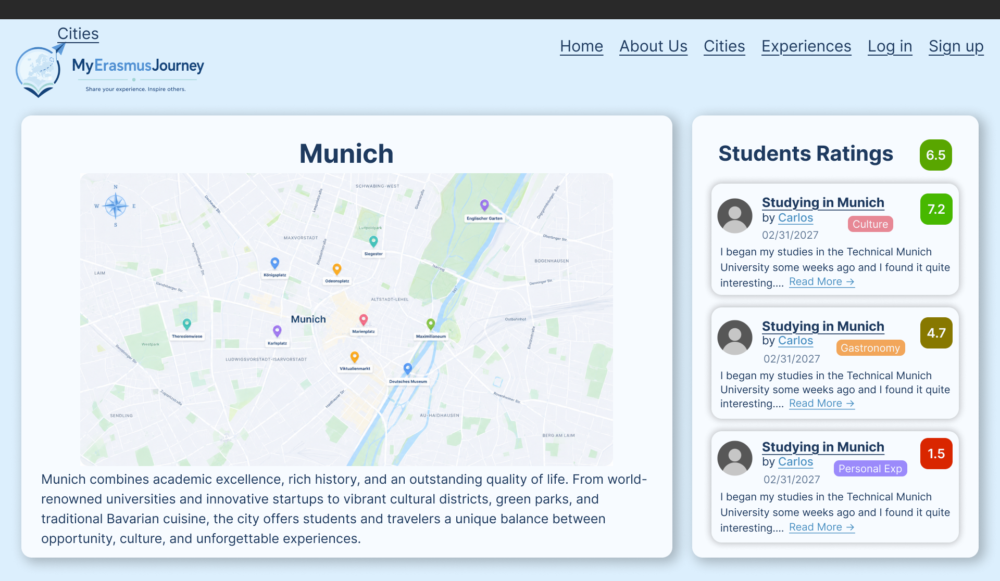

The city page shows a map of the city with the location of the experiences, which are also shown on the right side, as well as the average experience rating in the city and a small description about the city's attractiveness to students.

### City form
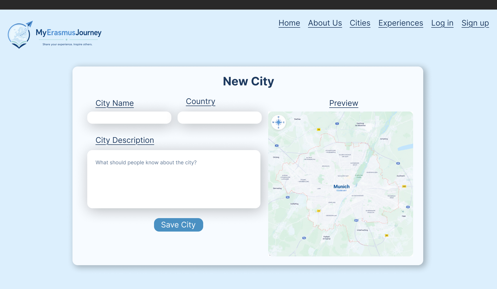

The city form is only available for administrators, it adds a new city to the application database, allowing for students to share their experiences of the new city. In order to add a city the administrator must give its name, the country where it's located and a small description. As a checking measure the administrator will have a preview of the new city in the map on the right side of the page.

### User
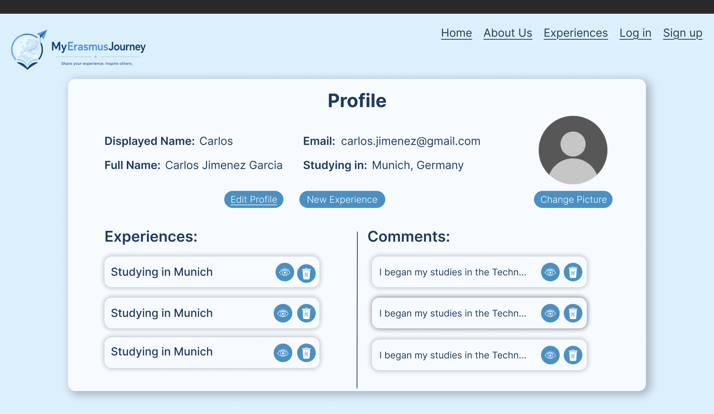

The user page will only show your own information, displaying the data you provided when you created the account and your activity on the application such as experiences and comments. It also allows you to change you profile image, edit your profile or delete as well as view any comment and experience you have posted.

### User form
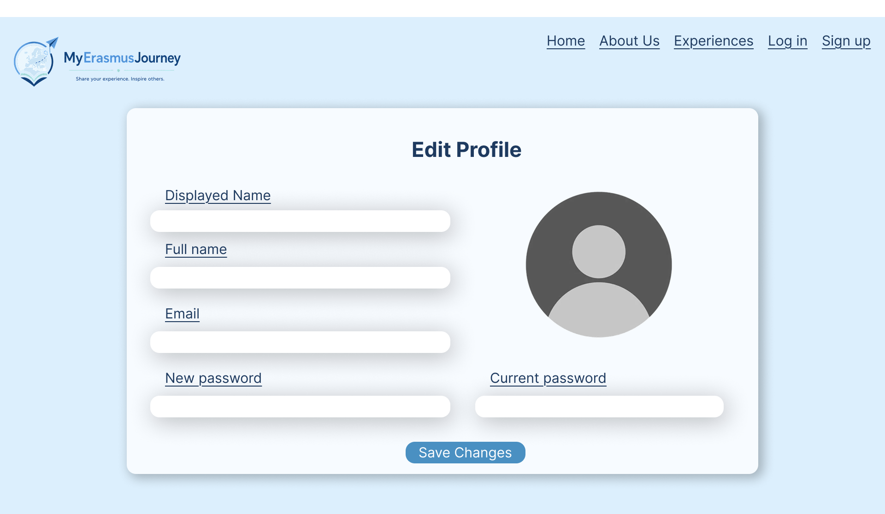

This user form allows to change the profile information, in order to save any changes the current password must be entered, even if the password is not being changed.