# 🛠️ Development Guide

## 📑 Index

1. [🏗️ Introduction](#️-introduction)
2. [🖥️ Technologies](#️-technologies)
3. [🧰 Tools](#-tools)
4. [🏛️ Architecture](#️-architecture)
5. [🛡️ Quality Assurance](#️-quality-assurance)
6. [🔄 Development Process](#-development-process)
7. [🚀 Application Execution and Code Edition](#-application-execution-and-code-edition)

---

## 🏗️ Introduction

*MyErasmusJourney* is a web application based on a **Single Page Application (SPA)** architecture. Unlike traditional multi-page websites, a SPA loads the application only once and dynamically updates its content as users navigate between pages. This approach considerably improves the user experience by providing smoother navigation, reducing loading times and avoiding full page refreshes.

The application follows a classic **client-server architecture** composed of three independent parts:

### 🎨 Frontend

The client is developed using **React** and is responsible for rendering the user interface, handling navigation and communicating with the backend through a REST API.

### ⚙️ Backend

The server is implemented with **Spring Boot** and contains the business logic, validation, authentication and communication with the database.

### 🗄️ Database

A **MySQL** relational database stores all persistent information, including users, cities, experiences, comments and multimedia files.

---

Communication between the client and server is performed through a **REST API**, while the backend accesses the database using **Spring Data JPA** repositories.

The project follows an **iterative and incremental development process**, where each new functionality is accompanied by automated tests and Continuous Integration workflows to ensure software quality throughout development.

---

### 📋 Technical Overview

| Component        | Type                | Main Technologies                        | Development Tools              | Quality Assurance                                     | Deployment                         | Development Process                                  |
| ---------------- | ------------------- | ---------------------------------------- | ------------------------------ | ----------------------------------------------------- | ---------------------------------- | ---------------------------------------------------- |
| 🎨 **Frontend**  | Web SPA             | React, TypeScript, Vite                  | Visual Studio Code             | Vitest, Testing Library, v8 Coverage                  | Local development server           | Iterative & Incremental using Git and GitHub Actions |
| ⚙️ **Backend**   | REST API            | Spring Boot, Java, Spring OpenAPI, Maven | IntelliJ IDEA                  | JUnit, Testcontainers, Rest Assured, Selenium, JaCoCo | Standalone Spring Boot application | Iterative & Incremental using Git and GitHub Actions |
| 🗄️ **Database** | Relational Database | MySQL                                    | Docker Desktop / Docker Engine | Integration tests using Testcontainers                | Docker Container                   | Version controlled together with the application     |

---

At the current stage of the project, the technical foundations have already been established, including:

- ✅ Frontend and backend projects.
- ✅ REST API documentation using OpenAPI.
- ✅ Automated testing infrastructure.
- ✅ Code coverage reports for both frontend and backend.
- ✅ Continuous Integration workflows with GitHub Actions.

These elements provide a solid foundation for implementing the remaining functionalities during the following development phases.

---

## 🖥️ Technologies

This section describes the main technologies used to build and execute the application. For each technology, a brief explanation of its role within the project is provided together with its official website.

---

### ⚛️ React

React is the frontend library used to develop the Single Page Application (SPA). It allows the user interface to be divided into reusable components that are dynamically rendered without requiring a full page reload.

Using React improves the user experience by updating only the necessary parts of the interface while keeping common elements, such as the navigation bar and footer, permanently loaded. The project uses React together with TypeScript to improve code maintainability and type safety.

**Official website:** https://react.dev/

---

### ⚡ Vite

Vite is the frontend build tool used during development. It provides a fast development server with Hot Module Replacement (HMR) and generates optimized production builds.

Its lightweight architecture considerably reduces compilation times compared to traditional bundlers, making the development process faster and more efficient.

**Official website:** https://vite.dev/

---

### ☕ Java

Java is the main programming language used to implement the backend of the application. It provides strong object-oriented programming features, platform independence through the Java Virtual Machine (JVM), and a mature ecosystem widely adopted in enterprise software development.

**Official website:** https://www.java.com/

---

### 🍃 Spring Boot

Spring Boot is the framework used to implement the backend REST API. It simplifies application configuration through dependency injection and annotation-based programming, allowing developers to focus on business logic rather than infrastructure.

Within this project it is responsible for exposing REST endpoints, implementing the business logic, accessing the database through Spring Data JPA, and managing the application's lifecycle.

**Official website:** https://spring.io/projects/spring-boot

---

### 🗄️ MySQL

MySQL is the relational database management system used to persist the application's information. It stores users, experiences, comments, cities and their relationships while ensuring data consistency through ACID transactions and referential integrity.

A relational database was selected because the project contains multiple entities with well-defined relationships and requires transactional consistency.

**Official website:** https://www.mysql.com/

---

### 📖 OpenAPI

OpenAPI is the specification used to describe and document the REST API exposed by the backend. It provides a standardized description of every endpoint, request and response, making the API easier to understand, test and integrate.

The generated documentation is published together with the project documentation and can be viewed directly from a web browser.

**Official website:** https://www.openapis.org/

---

### 📦 Maven

Apache Maven is the build automation and dependency management system used for the backend project. It automates compilation, dependency resolution, test execution, code coverage generation and packaging of the application.

Maven also provides a standardized project structure that improves maintainability and facilitates integration with GitHub Actions.

**Official website:** https://maven.apache.org/

---

## 🧰 Tools

### IntelliJ IDEA

The primary Integrated Development Environment (IDE) used for backend development. It provides advanced support for Java, Spring Boot, Maven, debugging, code analysis and automated testing.

Official website: https://www.jetbrains.com/idea/

---

### Visual Studio Code

The IDE used for frontend development. Its lightweight architecture and extensive extension ecosystem make it particularly suitable for React, TypeScript and Vite projects.

Official website: https://code.visualstudio.com/

---

### Git

Distributed version control system used to track source code changes, manage branches and maintain the project's development history.

Official website: https://git-scm.com/

---

### 🐈‍⬛ GitHub

Cloud platform used to host the repository, manage project planning through GitHub Projects, perform code reviews and automate quality checks using GitHub Actions.

Official website: https://github.com/

---

### 📦 Maven

Build automation and dependency management tool used for the backend. It handles project compilation, dependency resolution, test execution and packaging.

Official website: https://maven.apache.org/

---

### Vite

Frontend build tool used to create and serve the React application. It provides a fast development server, Hot Module Replacement (HMR) and optimized production builds.

Official website: https://vite.dev/

---

### pnpm

Package manager used for the frontend workspace. It efficiently manages dependencies through a content-addressable storage system while supporting monorepo structures.

Official website: https://pnpm.io/

---

### Docker Engine

Containerization platform used to run the MySQL database during development and to execute isolated integration tests using Testcontainers.

Official website: https://www.docker.com/products/docker-desktop/

---

## 🏛️ Architecture

### Overall Architecture

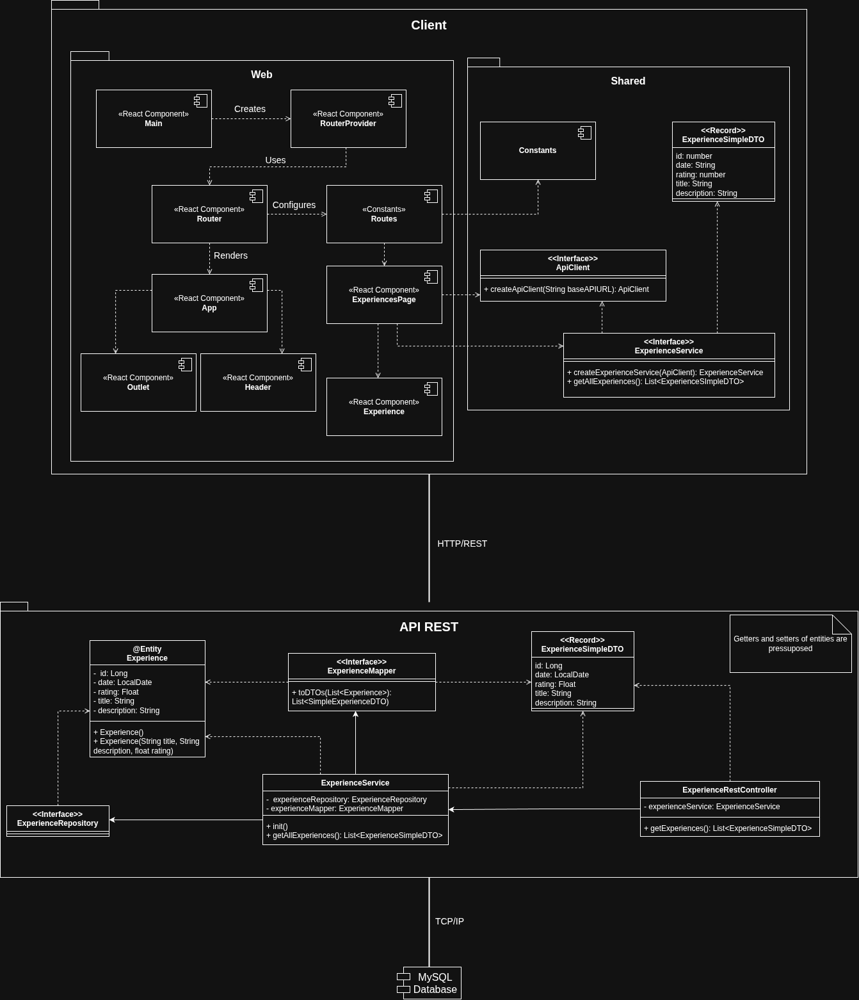

The application follows a three-layer architecture composed of a client, a REST API and a database.

The client communicates with the backend through HTTP REST requests, exchanging information in JSON format. The REST API is responsible for processing requests, applying the business logic and interacting with the persistence layer. Finally, the backend communicates with the MySQL database through TCP/IP to store and retrieve the application data.

This separation of responsibilities improves maintainability, scalability and allows each layer to evolve independently.

---

### Client Architecture

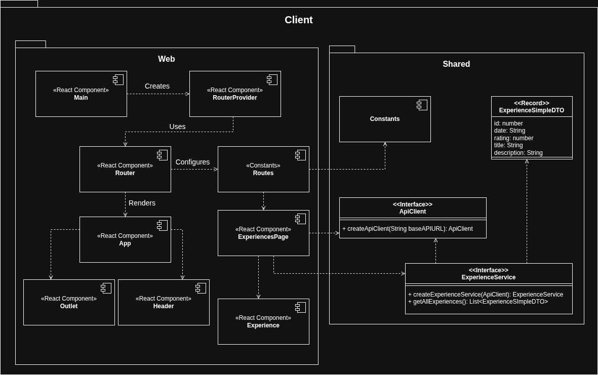

The client is divided into two main modules: **Web** and **Shared**.

The **Web** module contains the React components responsible for rendering the user interface, handling navigation and managing the application's pages. The execution starts in the `Main` component, which initializes the `RouterProvider`. The router loads the route configuration and renders the `App` component, where common elements such as the header remain persistent while the `Outlet` dynamically displays the page associated with the current URL.

The **Shared** module contains reusable components that are independent of the user interface, including DTOs, service interfaces, API communication utilities and configuration constants. This architecture reduces coupling between the presentation layer and the communication layer while allowing the same business logic to be reused by future client applications, such as the planned mobile application.

Whenever a page needs to communicate with the backend, it does so through the corresponding service, which internally uses the `ApiClient` abstraction to perform the HTTP requests.

---

### Server Architecture

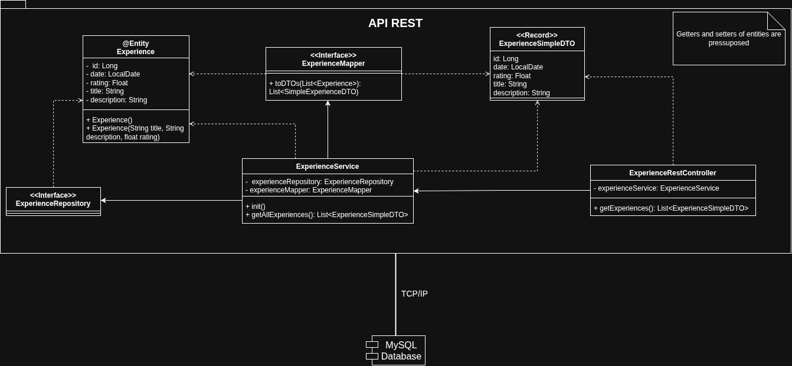

The backend follows the layered architecture recommended by Spring Boot, separating presentation, business logic and persistence responsibilities.

The execution flow begins when an HTTP request reaches one of the REST controllers. The controller validates the incoming request and delegates the operation to the corresponding service.

The service contains the application's business logic. It performs the required operations and interacts with the persistence layer through the repository interfaces. Whenever information must be transferred between the API and the domain model, MapStruct mappers are used to convert between domain entities and Data Transfer Objects (DTOs), keeping both models independent.

Repositories provide the abstraction over the database, allowing the services to retrieve or persist information without directly interacting with SQL queries.

Once the requested operation has been completed, the resulting DTO is returned to the controller, which generates the corresponding HTTP response and sends it back to the client.

The current REST endpoints and the DTOs exchanged by the API can be consulted in the generated OpenAPI documentation:

**API Documentation:**  
https://raw.githack.com/codeurjc-students/2026-MyErasmusJourney/main/docs/api/api-docs.html

---

## 🛡️ Quality Assurance

Software quality has been considered a fundamental aspect of the project since the beginning of the implementation phase. Every new functionality is accompanied by automated tests and validated through a Continuous Integration (CI) pipeline before being integrated into the main branch.

The quality assurance strategy combines automated testing, code coverage analysis and continuous integration, allowing regressions to be detected early and ensuring that every software increment remains stable throughout the iterative development process.

---

### 🎯 Quality Objectives

The quality assurance process pursues the following objectives:

- Verify that every implemented functionality behaves as expected.
- Detect regressions automatically after every modification.
- Ensure communication between all application layers.
- Measure the percentage of source code executed by automated tests.
- Guarantee that every contribution passes the same validation process through GitHub Actions.

---

### 🧪 Automated Testing

The project includes automated tests covering every layer of the application.

| Layer | Test Type | Tool |
|--------|-----------|------|
| Backend | Unit Tests | JUnit + Mockito |
| Backend | Integration Tests | JUnit + Testcontainers |
| Backend | REST API Tests | Rest Assured |
| Frontend | Unit Tests | Vitest |
| Frontend | Integration Tests | Vitest + Testing Library |
| Frontend | System Tests | Selenium WebDriver |

---

### 🔹 Backend Tests

#### Unit Tests

Backend unit tests verify the behaviour of the service layer in isolation by mocking repository dependencies.

These tests validate:

- Business logic.
- Mapper behaviour.
- Exception handling.
- Returned DTOs.
- Repository interaction.

**Implemented test classes**

- ExperienceMapperTest
- ExperienceRestControllerTest
- ExperienceServiceTest
- ExperienceSimpleDTOTest
- ExperienceTest

---

#### Integration Tests

Integration tests verify the interaction between the application and the database.

A temporary MySQL container is automatically created using Testcontainers, ensuring that every test starts from a clean database state.

The integration tests validate:

- CRUD operations.
- Entity persistence.
- Repository behaviour.
- Mapper integration.
- Transaction consistency.

---

### REST API Tests

REST API tests validate the public endpoints exposed by the application.

These tests verify:

- HTTP status codes.
- Returned JSON structure.
- Request validation.
- Endpoint behaviour.
- Error responses.

---

### 🎨 Frontend Tests

#### Unit Tests

Frontend unit tests validate isolated React components and utility functions.

The current tests verify:

- Component rendering.
- Conditional rendering.
- User interaction.
- Routing behaviour.
- Service logic.

---

#### Integration Tests

Frontend integration tests verify the interaction between multiple components.

Examples include:

- Navigation between pages.
- Data loading.
- Communication with mocked services.
- Page rendering after API responses.

---

#### System Tests

System tests validate the complete application from the user's perspective.

The backend and frontend are automatically started before executing the Selenium tests.

These tests verify complete user workflows such as:

- Opening the application.
- Navigating through pages.
- Loading experiences.
- Displaying information returned by the REST API.

---

### 📋 Functional Traceability

The following table shows the relationship between the implemented automated tests and the functional requirements defined during the analysis phase.

| Functional Requirement | Tested | Test Type   | Test Class                   | Layer  |
| ---------------------- | :----: | ----------- | ---------------------------- | ------ |
| Showing Experiences    |   ✅    | Unit        | ExperienceMapperTest         | Server |
| Showing Experiences    |   ✅    | Unit        | ExperienceRestControllerTest | Server |
| Showing Experiences    |   ✅    | Unit        | ExperienceServiceTest        | Server |
| Showing Experiences    |   ✅    | Unit        | ExperienceSimpleDTOTest      | Server |
| Showing Experiences    |   ✅    | Unit        | ExperienceTest               | Server |
| Showing Experiences    |   ✅    | Integration | ExperienceServiceTest        | Server |
| Showing Experiences    |   ✅    | E2E         | ExperiencesTest              | Server |
| Showing Experiences    |   ✅    | System      | ExperiencesPageTest          | Server |
| Showing Experiences    |   ✅    | Unit        | Experience.service.test      | Client |
| Showing Experiences    |   ✅    | Unit        | Experience.test              | Client |
| Showing Experiences    |   ✅    | Unit        | ExperiencesPage.test         | Client |
| Showing Experiences    |   ✅    | Integration | Experiences.test             | Client |

---

### 📊 Test Statistics

The current automated test suite includes:

| Metric | Backend | Frontend |
|---------|---------|----------|
| Unit Tests | XX | XX |
| Integration Tests | XX | XX |
| System Tests | XX | — |
| REST API Tests | XX | — |
| Total Tests | XX | XX |

---

### 📈 Code Coverage

Code coverage is measured independently for both application layers.

| Layer | Tool |
|--------|------|
| Backend | JaCoCo |
| Frontend | Istanbul |

#### Backend Coverage

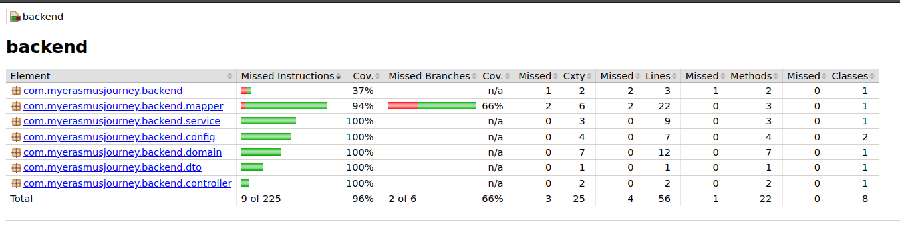

Coverage summary:

- Line coverage: 96 %
- Branch coverage: 66 %
- Classes covered: 8 / 8

---

#### Frontend Coverage

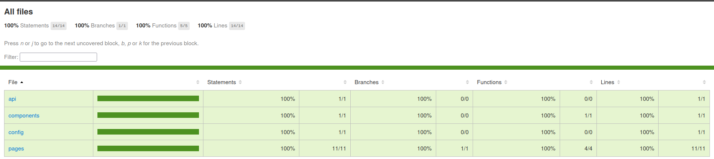

Coverage summary:

- Statements: 100 %
- Branches: 100 %
- Functions: 100 %
- Lines: 100 %

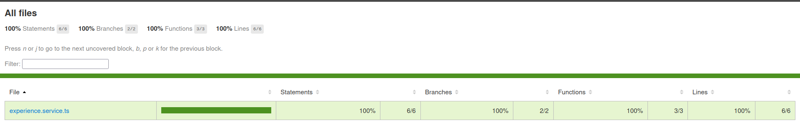

Coverage summary:

- Statements: 100 %
- Branches: 100 %
- Functions: 100 %
- Lines: 100 %

---

### 📏 Code Metrics

The current size of the project is summarised below.

| Technology | Files | Classes / Components | Lines of Code |
| ---------- | ----: | -------------------: | ------------: |
| Java       |    18 |                   18 |           644 |
| TypeScript |    20 |                   18 |           405 |
| Markdown   |    17 |                    0 |           896 |
| YAML       |     6 |                    0 |          4226 |
| HTML       |     2 |                    0 |           321 |
| CSS        |     2 |                    0 |           258 |
| Javascript |     1 |                    0 |            21 |

---

### ✅ Quality Summary

The combination of automated testing, code coverage analysis and continuous integration provides a robust quality assurance process that detects defects early, reduces regressions and guarantees that every iteration of the project maintains a stable and deployable state.

---

## 🔄 Development Process

The project follows an **Iterative and Incremental Development** methodology.

Instead of implementing the entire application at once, development is divided into small iterations where each functionality is designed, implemented, tested and integrated before moving to the next one.

The development workflow follows these steps:

1. A new task is created in the GitHub Project board.
2. A dedicated feature branch is created following the GitHub Flow strategy.
3. The functionality is implemented together with its corresponding automated tests.
4. Local quality checks are executed.
5. GitHub Actions automatically validates the changes.
6. The branch is merged into the main branch after all quality checks have passed.

This workflow ensures that every increment of the application remains functional and that software quality is maintained throughout the project.

### 🌿 Git Strategy

The project follows the **GitHub Flow** branching model.

- `main` always contains the latest stable version.
- New functionalities are implemented in feature branches.
- Bug fixes are implemented in dedicated fix branches.
- Changes are merged through Pull Requests after passing all automated quality controls.

### 📋 Project Management

Project planning and task tracking are performed using **GitHub Projects** following a Kanban workflow.

Tasks are organised according to their current state:

- Backlog
- To Do
- In Progress
- Review
- Done

This allows the development progress to be monitored throughout every phase of the project.

### 🚀 Continuous Integration

Every commit pushed to the repository is automatically validated through GitHub Actions.

The CI workflow performs the following checks:

- Backend compilation.
- Frontend compilation.
- Backend automated tests.
- Frontend automated tests.
- Selenium system tests.
- Code coverage generation.

Only after all quality controls have passed can the changes be merged into the main branch.

#### CI Pipeline

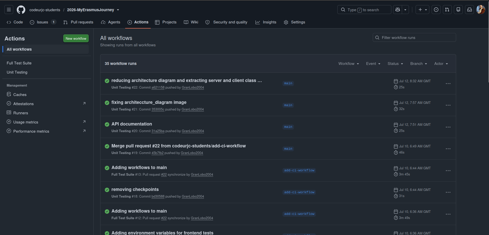

---

## 🚀 Application Execution and Code Edition

This section explains how to prepare the development environment, clone the repository and execute the complete application locally.

The process consists of four steps:

1. Install the required software.
2. Clone the repository.
3. Configure the environment variables.
4. Start the database, backend and frontend.

### 📋 Requirements

In order to clone, execute and download the repository, the following technologies and tools must be downloaded.
- Tools:
	- Intellij IDEA
	- Maven
	- Git
	- Pnpm
	- Visual Studio Code
	- Docker Engine
- Technologies:
	- Java
	- Node js

---

### 📥 Cloning the repository

After all the requirements have been installed you may access the repository URL and obtain the URL to clone it by pressing the green button with the word "Code". After that you will have to copy the URL you have obtained and run it on a terminal after the command `git clone`, the following line is an example of how the command should look.

`git clone https://github.com/codeurjc-students/2026-MyErasmusJourney.git` 
	or 
`git clone git@github.com:codeurjc-students/2026-MyErasmusJourney.git`
	if you are using SSH

The terminal should display a text very similar to the one in the image.

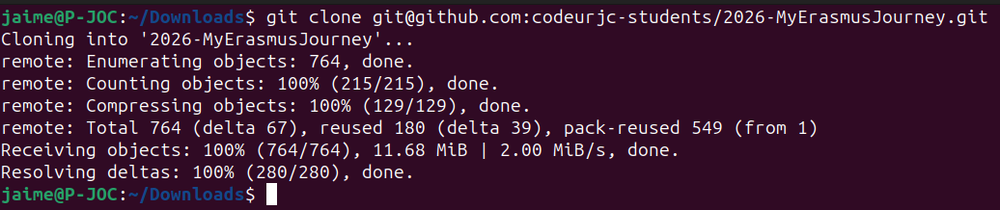

---

### 🗄️ Starting the database

First of all you need to start the database in a Docker container. If it is the first time, you will have to run the following command and fill the name of the database and root password.

`docker run -e MYSQL_ROOT_PASSWORD=Password -e MYSQL_DATABASE=DatabaseName -p 3306:3306 -d mysql:9.3`

In case it's not the first time you will have to run `docker start containerName` the container name is unique in every computer so you will have to know your container's name.

---

### ⚙️ Running the backend

Once the database is operational you will have to open either Intellij IDEA or the terminal in the backend folder.

- With Intellij IDEA:
	First of all, you need to install the .env files plugin
	
	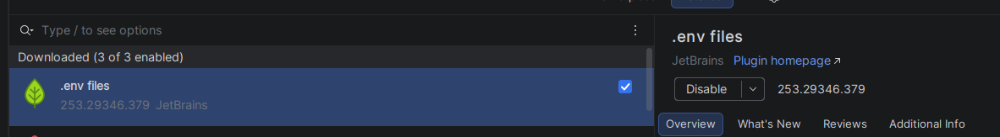
	
	Click the open button on the top of the window and open the backend folder of the project. After opening the project wait for the IDE complete indexation and create a file name `.env` in the root of the backend folder with the following information. The database name and password must be exactly the same as you filled them in the database command when you first runned it, the port can be changed to any port that is free in your computer.
	
	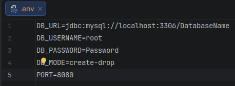
	
	After filling the environment variables you will have to create a run configuration by clicking the three dots and the edit option on the top menu.
	
	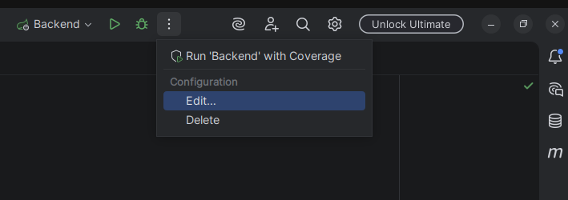
	
	Add a new Springboot configuration with the add option on the top-left corner of the  window.
	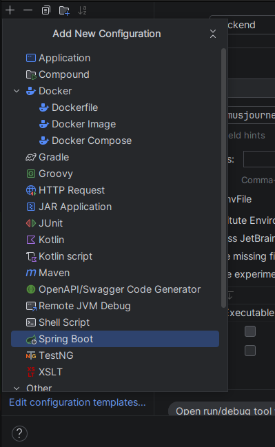  
	
	Afterwards, select the `Modify options` and select the EnvFile option to enable the environment variables file. 
	
	
	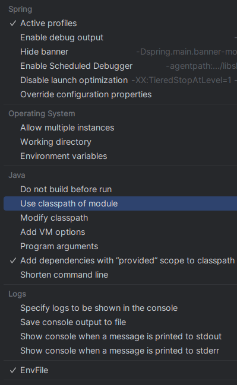
	
	Lastly, you'll have to select the BackendApplication file as the main class of the run configuration and java 21 and add the env file to the table of environment variables. The image below shows the configuration after all these steps.
	
	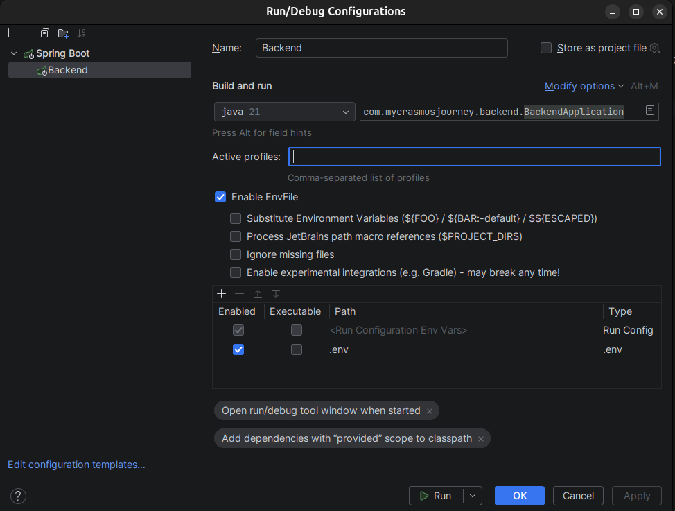
	
	Finally, hit apply and run with the database running on the background.

- Without  IDE:
	Open the terminal and export all the environment variables present on the env file image with the following command:
	
		export variable=value
	
	Afterwards you just need to run the command:
	
		`mvn spring-boot:run`

---

### 🎨 Running the frontend

After the server is working you may begin to execute the client side. Begin by opening a terminal on the frontend folder and installing the dependencies with `pnpm install`. 

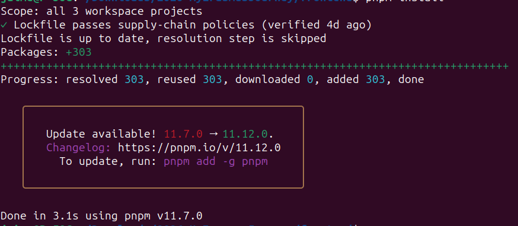

Just like with the server you will have to create a .env file with the URL of the API as an environment variable. It is quite important to set the right port otherwise no data will be shown. In the example image the port is 8080.

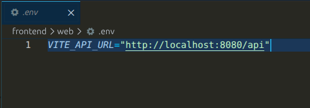

Only after all installation is done you may run the command `pnpm --filter web run dev`, shortly after the website will be running. You may access the website from your computer by opening any web browser and entering the link that appears on the terminal.

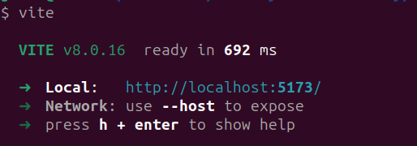

---

### 🧰 Tools and API Interaction

In order to test the API or try any of the example requests you need to install Postman. Preferably in Visual Studio Code.

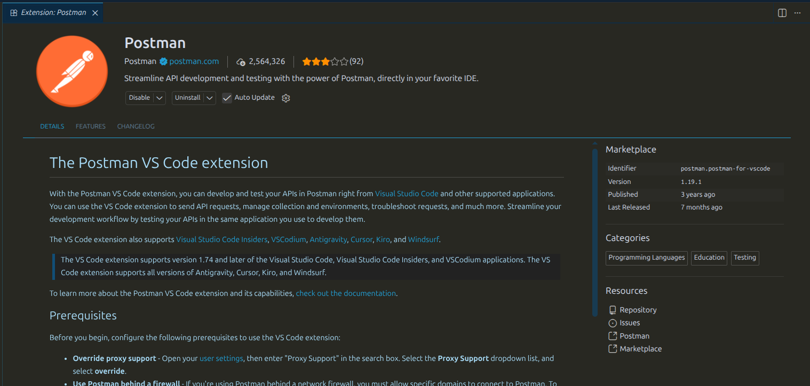

Once installed you'll need to create an account or login and import the collection located in the API folder of this repository inside the documentation folder. Finally for the requests to work you need to start the database and the server, create an environment and set a variable called APIURL, the value must be almost identical to the one below, changing the port 8080 to whatever port you used to start up the server.

With the environment set, you may choose any of the requests and click the send button to test the API and check both the request's body and API's response.

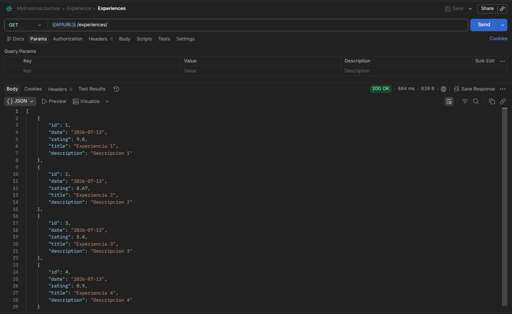

---

### 🧪 Executing the automated tests

For the backend tests, docker needs to be running. After checking docker is running the command `mvn test` or `mvn clean test` needs to be executed on a terminal opened in the backend folder.

As for the frontend tests you'll need to be executing the database and backend before starting the tests. Afterwards you'll need to install the dependencies, only if it is first time, with the command `pnpm install`on a terminal in the frontend folder. Lastly you may run all the web tests with the command `pnpm --filter web run test`and `pnpm --filter shared run test`for the shared folder tests.

---

🏠 [Home](../README.md) | 📚 Documentation
---