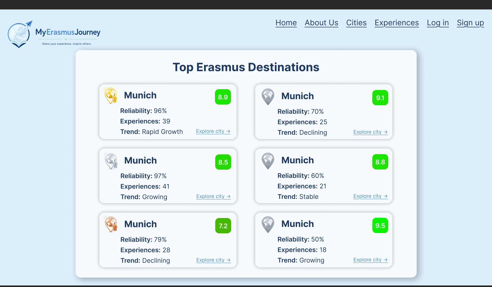

# Web Interface

This document describes the main pages of the application and the navigation flow between them.

The top navigation menu is available in all pages and provides access to the main sections of the platform.

---

## 🏠 Home

This is the landing page of the application. It introduces the platform and its main objectives.

### 🔗 Navigation from this page:
- Experiences
- Cities
- About Us
- Log in / Sign up (if not authenticated)
- User profile (if authenticated)

---

## ℹ️ About Us

This page explains the purpose of the application and the problem it solves for Erasmus students.

### 🔗 Navigation from this page:
- Home
- Experiences
- Cities
- Log in / Sign up

---

## ❌ Error Page

This page is displayed when:
- A route does not exist (404)
- An internal server error occurs
- A user tries to access restricted content

### 🔗 Navigation from this page:
- Home
- Previous valid page (browser back)

---

## 🔐 Log in

Authentication page where users can log into their account.

### 🔗 Navigation from this page:
- Home
- Sign up
- After login → User Profile (redirect)

---

## 📝 Sign up

Registration page for new users.

### 🔗 Navigation from this page:
- Home
- Log in
- After registration → Log in page

---

## 📚 Experiences

Page that displays all experiences published by users. It includes filtering and search by city, category, date, and title.

### 🔗 Navigation from this page:
- Experience detail page
- Home
- User profile

---

## 📖 Experience Detail

Detailed view of a single experience including full content, multimedia, and comments.

### 🔗 Navigation from this page:
- Home
- Profile page
- Experiences list
- City page
- Share experience (external)
- Create comment (if authenticated)

---

## ✍️ Experience Form

Form used by authenticated users to create a new experience.

### 🔗 Navigation from this page:
- Experiences (after submission)
- Home
- User profile

---

## 🌍 Cities

Page displaying all available cities with an interactive map.

### 🔗 Navigation from this page:
- City detail page (by clicking a city)
- Home
- Experiences
- User profile
- City ranking

---

## 🏙️ City Detail

Shows detailed information about a city, including:
- Map with experience locations
- List of experiences
- Average rating

### 🔗 Navigation from this page:
- Experience detail page
- Experiences
- User profile

---

## 🏆 City Ranking  
  
  
This page displays the ranking of Erasmus destinations based on the platform's advanced ranking algorithm.  
  
The ranking combines two main factors:  
  
- **Average Rating**: Average score given by students in their experiences.  
- **Reliability Score**: Confidence level calculated from the number of published experiences associated with the city.  
  
The objective is to prevent cities with only a few highly-rated experiences from appearing above destinations that have been consistently rated by a larger number of students.  
  
Each city card displays:  
- Position in the ranking  
- Average rating  
- Reliability percentage  
- Number of published experiences  
- Trend indicator (Growing, Stable or Declining)  
  
The first three positions are visually highlighted with gold, silver and bronze medals.  
  
### 🔗 Navigation from this page:  
- City detail page  
- Cities page  
- Experiences  
- Home  
- User profile

---

## ➕ City Form (Admin only)

Form used by administrators to add new cities to the system.

### 🔗 Navigation from this page:
- Cities list
- Home

---

## 👤 User Profile

User dashboard showing personal data, experiences, comments, and account management options.

### 🔗 Navigation from this page:
- Experience detail pages (own posts)
- Edit profile
- Experiences
- New experience form
- Cities
- Home

---

## ✏️ User Form

Allows users to edit their profile information. Password confirmation is required for security.

### 🔗 Navigation from this page:
- User profile (after update)
- Home
- Home (if delete account selected)